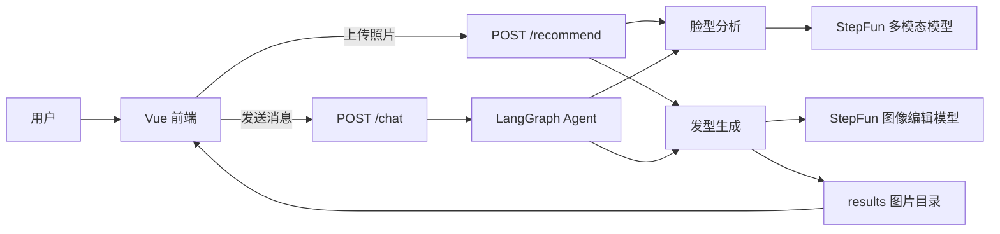

# 发发 · AI 发型顾问

发发是一款面向发型试戴与发型建议场景的 AI 应用。用户上传本人照片后，系统会分析脸型，推荐适合的发型，并可根据用户输入生成换发效果图。项目包含 Vue/Vite 前端与 FastAPI 后端，后端通过阶跃星辰 StepFun 相关模型完成脸型分析、对话推荐和图像编辑。

## 功能特性

- 上传照片并自动分析脸型
- 根据脸型推荐适合的发型与应避免的发型
- 生成推荐发型效果图
- 支持对话式继续调整发型，例如“再短一点”“试戴羊毛卷”
- 支持快捷发型标签，便于快速试戴
- 支持清除当前会话
- 前端适配移动端聊天式交互体验

## 项目结构

```text
hackathon/
├── frontend/                 # Vue + Vite 前端
│   ├── src/
│   │   ├── App.vue           # 主页面与交互逻辑
│   │   ├── main.js           # 前端入口
│   │   └── style.css         # 全局样式
│   ├── package.json
│   └── vite.config.js
├── hair-advisor/             # Python 后端
│   ├── agent.py              # FastAPI 服务与 LangGraph Agent
│   ├── analyze_face.py       # 脸型分析能力
│   ├── change_hair.py        # 发型图像编辑能力
│   ├── requirements.txt      # 后端依赖
│   └── results/              # 生成图片输出目录
├── README.md
├── README.en.md
├── LICENSE
└── .gitignore
```

## 技术架构



### 前端

- 框架：Vue 3
- 构建工具：Vite
- 入口文件：`frontend/src/main.js`
- 主页面：`frontend/src/App.vue`
- 默认后端地址：`http://localhost:8000`
- 可通过环境变量 `VITE_API_BASE` 修改后端地址

### 后端

- Web 框架：FastAPI
- Agent 编排：LangGraph
- 大模型调用：LangChain OpenAI 兼容接口
- 多模态分析：`step-1v-8k`
- 对话模型：`step-1-8k`
- 图像编辑模型：`step-image-edit-2`

## 环境要求

- Node.js 18+ 推荐
- Python 3.10+ 推荐
- 可用的 StepFun API Key

## 后端启动

进入后端目录：

```bash
cd hair-advisor
```

安装依赖：

```bash
pip install -r requirements.txt
```

创建 `.env` 文件：

```env
STEP_API_KEY=你的_STEP_API_KEY
STEP_BASE_URL=https://api.stepfun.com/v1
```

启动服务：

```bash
python agent.py
```

服务默认运行在：

```text
http://localhost:8000
```

## 前端启动

进入前端目录：

```bash
cd frontend
```

安装依赖：

```bash
npm install
```

启动开发服务器：

```bash
npm run dev
```

如需指定后端地址，可在 `frontend` 目录下创建 `.env`：

```env
VITE_API_BASE=http://localhost:8000
```

## 使用流程

1. 启动后端服务。
2. 启动前端服务。
3. 在浏览器中打开 Vite 提供的访问地址。
4. 上传一张人物照片。
5. 等待系统分析脸型并生成推荐发型效果图。
6. 继续输入想试的发型或调整需求，例如：
   - `试戴羊毛卷`
   - `推荐锁骨短发`
   - `再短一点`
   - `颜色太深`

## 后端接口

### `POST /recommend`

上传照片后分析脸型，并生成一张推荐发型效果图。

请求表单：

| 字段 | 类型 | 必填 | 说明 |
| --- | --- | --- | --- |
| `session_id` | string | 是 | 会话 ID |
| `image` | file | 是 | 用户照片 |
| `hair_desc` | string | 否 | 发型描述，默认生成适合当前脸型的自然时尚发型 |

返回内容：

| 字段 | 说明 |
| --- | --- |
| `reply` | 脸型分析与推荐文本 |
| `session_id` | 会话 ID |
| `image` | 生成图片路径 |
| `recommendations` | 推荐发型快捷标签 |

### `POST /chat`

发送对话消息，支持基于已有照片继续生成或调整发型。

请求表单：

| 字段 | 类型 | 必填 | 说明 |
| --- | --- | --- | --- |
| `session_id` | string | 是 | 会话 ID |
| `message` | string | 是 | 用户消息 |
| `image` | file | 否 | 新上传的照片 |

### `DELETE /session/{session_id}`

清空指定会话历史。

## 注意事项

- `.env`、上传图片、生成图片、依赖目录等不应提交到代码仓库。
- 前端限制上传图片类型为 `jpg`、`png`、`webp`。
- 前端限制上传图片大小不超过 10MB。
- 后端生成图片会保存到 `hair-advisor/results/`。
- 后端运行时可能会创建 `uploads/` 目录保存临时上传文件。
- 若图像生成失败，请检查 API Key、网络连接、模型权限与接口额度。

## 参与贡献

1. Fork 本仓库。
2. 新建功能分支，例如 `feat/xxx`。
3. 提交代码并说明改动内容。
4. 发起 Pull Request。

## License

本项目遵循仓库中的 `LICENSE` 文件。
